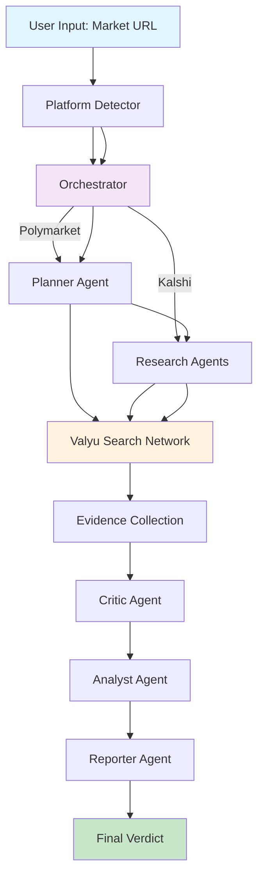
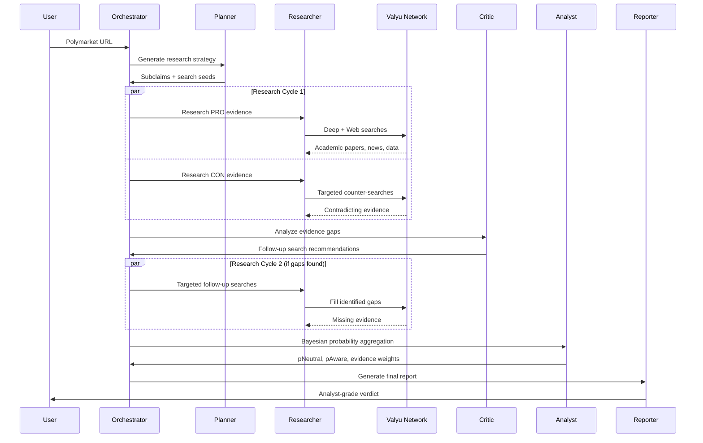
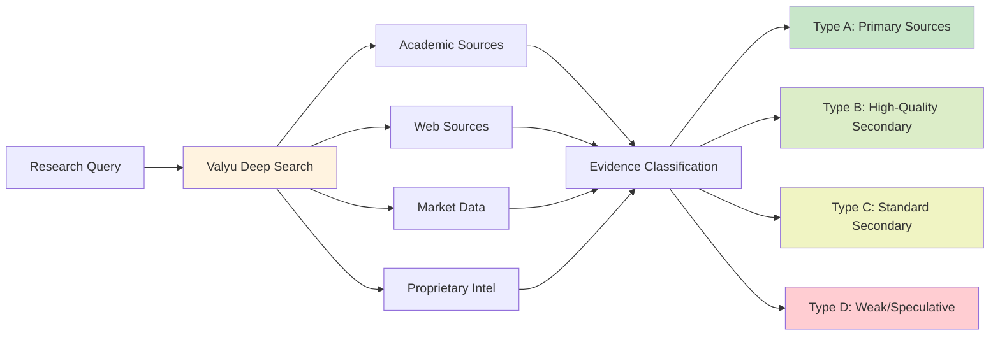
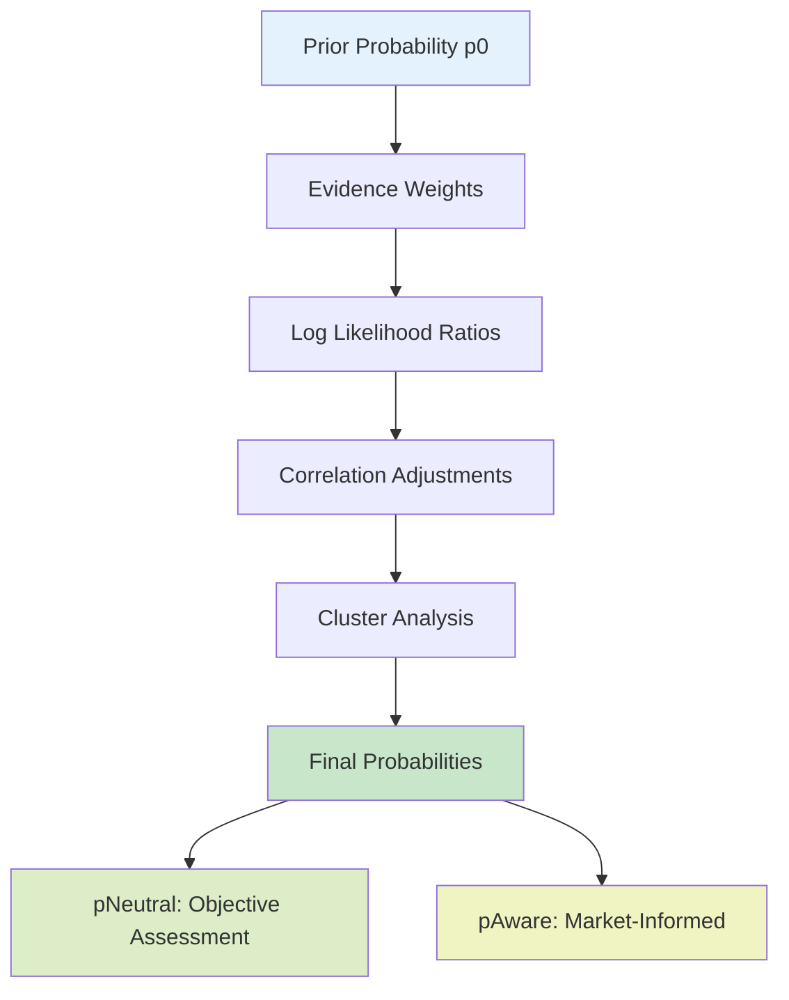

# Polyseer - See the Future.

> *Everyone wishes they could go back and buy Bitcoin at $1. Polyseer brings the future to you, so you never have to wonder "what if?" again.*

**NOT FINANCIAL ADVICE** | Polyseer provides analysis for entertainment and research purposes only. Always DYOR.

## Quick Start (Self-Hosted)

The easiest way to run Polyseer is in self-hosted mode with just 3 environment variables:

```bash
git clone https://github.com/yorkeccak/polyseer.git
cd polyseer
npm install

# Create .env.local with:
# NEXT_PUBLIC_APP_MODE=self-hosted
# VALYU_API_KEY=valyu_xxx        # Get from platform.valyu.ai
# OPENAI_API_KEY=sk-xxx          # Get from platform.openai.com

npm run dev
```

Open [localhost:3000](http://localhost:3000), paste any **Polymarket or Kalshi** URL, and get your analysis.

Self-hosted mode features:
- No authentication required
- Local SQLite database (automatically created)
- Unlimited queries using your API keys
- Perfect for personal use and development

## What is Polyseer?

Prediction markets tell you what might happen. Polyseer tells you why.

Drop in any **Polymarket or Kalshi** URL and get a structured analysis that breaks down the actual factors driving an outcome. Instead of gut feelings or surface-level takes, you get systematic research across academic papers, news, market data, and expert analysis.

The system uses multiple AI agents to research both sides of a question, then aggregates the evidence using Bayesian probability math. Think of it as having a research team that can read thousands of sources in minutes and give you the key insights.

**Core features:**
- Systematic research across academic, web, and market data sources
- Evidence classification and quality scoring
- Mathematical probability aggregation (not just vibes)
- Both sides research to avoid confirmation bias
- Real-time data, not stale information

Built for developers, researchers, and anyone who wants rigorous analysis instead of speculation.

---

## Architecture Overview

Polyseer is built on a **multi-agent AI architecture** that orchestrates specialized agents to conduct deep analysis. Here's how it works:



### Agent System Deep Dive



## Deep Research System

### Valyu Integration

Polyseer uses the Valyu API for its research capabilities, providing access to:

- **Academic Papers**: Real-time research publications
- **Web Intelligence**: Fresh news and analysis
- **Market Data**: Financial and trading information
- **Proprietary Datasets**: Exclusive Valyu intelligence



### Evidence Quality System

Each piece of evidence is rigorously classified:

| Type | Description | Cap | Examples |
|------|-------------|-----|----------|
| **A** | Primary Sources | 2.0 | Official documents, press releases, regulatory filings |
| **B** | High-Quality Secondary | 1.6 | Reuters, Bloomberg, WSJ, expert analysis |
| **C** | Standard Secondary | 0.8 | Reputable news with citations, industry publications |
| **D** | Weak/Speculative | 0.3 | Social media, unverified claims, rumors |

## Mathematical Foundation

### Bayesian Probability Aggregation

Polyseer uses sophisticated mathematical models to combine evidence:



**Key Formulas:**
- **Log Likelihood Ratio**: `LLR = log(P(evidence|YES) / P(evidence|NO))`
- **Probability Update**: `p_new = p_old * exp(LLR)`
- **Correlation Adjustment**: Accounts for evidence clustering and dependencies

### Evidence Influence Calculation

Each piece of evidence receives an influence score based on:
- **Verifiability**: Can the claim be independently verified?
- **Consistency**: Internal logical coherence
- **Independence**: Number of independent corroborations
- **Recency**: How fresh is the information?

## Technology Stack

### Frontend
- **Next.js 15.5** - React framework with Turbopack
- **Tailwind CSS 4** - Utility-first styling
- **Framer Motion** - Smooth animations
- **Radix UI** - Accessible components
- **React 19** - Latest React features

### Backend & APIs
- **AI SDK** - LLM orchestration
- **GPT-5** - Advanced reasoning model
- **Valyu API** - Search and research capabilities
- **Polymarket API** - Market data fetching
- **Kalshi API** - Market data fetching
- **SQLite/Supabase** - Database (mode-dependent)

### State Management
- **Zustand** - Simple state management
- **TanStack Query** - Server state synchronization

### Infrastructure
- **TypeScript** - Type safety throughout
- **Zod** - Runtime type validation
- **ESLint** - Code quality

---

## Getting Started

### Prerequisites

- **Node.js 18+**
- **npm/pnpm/yarn**
- **OpenAI API key** - For GPT-5 access
- **Valyu API key** - For search capabilities (get at [platform.valyu.ai](https://platform.valyu.ai))

### 1. Clone the Repository

```bash
git clone https://github.com/your-org/polyseer.git
cd polyseer
```

### 2. Install Dependencies

```bash
npm install
# or
pnpm install
```

### 3. Environment Setup

Create `.env.local` with your configuration:

#### Self-Hosted Mode (Recommended)

```env
# ===========================================
# Self-Hosted Mode Configuration
# ===========================================
NEXT_PUBLIC_APP_MODE=self-hosted
NEXT_PUBLIC_APP_URL=http://localhost:3000

# ===========================================
# Required API Keys
# ===========================================
# Get your Valyu API key at: https://platform.valyu.ai
VALYU_API_KEY=valyu_your_api_key_here

# Get your OpenAI API key at: https://platform.openai.com
OPENAI_API_KEY=sk-your_openai_api_key_here
```

That's it! Self-hosted mode uses a local SQLite database that's automatically created.

#### Valyu Mode (Advanced)

> **Note:** Valyu OAuth apps will be in general availability soon. Currently client id/secret are not publicly available. Contact contact@valyu.ai if you need access.

```env
# ===========================================
# Valyu Mode Configuration
# ===========================================
NEXT_PUBLIC_APP_MODE=valyu
NEXT_PUBLIC_APP_URL=https://yourdomain.com

# ===========================================
# Valyu OAuth Configuration
# ===========================================
NEXT_PUBLIC_VALYU_SUPABASE_URL=https://xxx.supabase.co
NEXT_PUBLIC_VALYU_CLIENT_ID=your-oauth-client-id
VALYU_CLIENT_SECRET=your-oauth-client-secret
VALYU_APP_URL=https://platform.valyu.ai

# ===========================================
# App's Own Supabase (Required for Valyu Mode)
# ===========================================
NEXT_PUBLIC_SUPABASE_URL=https://your-app.supabase.co
NEXT_PUBLIC_SUPABASE_ANON_KEY=your-supabase-anon-key
SUPABASE_SERVICE_ROLE_KEY=your-service-role-key

# ===========================================
# Required API Keys
# ===========================================
VALYU_API_KEY=valyu_your_api_key_here
OPENAI_API_KEY=sk-your_openai_api_key_here
```

### 4. Start the Development Server

```bash
npm run dev
```

Open [http://localhost:3000](http://localhost:3000) and start analyzing.

---

## Agent System Details

### Planner Agent
**Purpose**: Break down complex questions into research pathways
**Input**: Market question
**Output**: Subclaims, search seeds, key variables, decision criteria

```typescript
interface Plan {
  subclaims: string[];      // Causal pathways to outcome
  keyVariables: string[];   // Leading indicators to monitor
  searchSeeds: string[];    // Targeted search queries
  decisionCriteria: string[]; // Evidence evaluation criteria
}
```

### Researcher Agent
**Purpose**: Gather evidence from multiple sources
**Tools**: Valyu Deep Search, Valyu Web Search
**Process**:
1. Initial bilateral research (PRO/CON)
2. Evidence classification (A/B/C/D)
3. Follow-up targeted searches

### Critic Agent
**Purpose**: Identify gaps and provide quality feedback
**Analysis**:
- Missing evidence areas
- Duplication detection
- Data quality concerns
- Correlation adjustments
- Follow-up search recommendations

### Analyst Agent
**Purpose**: Mathematical probability aggregation
**Methods**:
- Bayesian updating
- Evidence clustering
- Correlation adjustments
- Log-likelihood calculations

### Reporter Agent
**Purpose**: Generate human-readable analysis
**Output**: Markdown report with:
- Executive summary
- Evidence synthesis
- Risk factors
- Confidence assessment

---

## Security & Privacy

### Data Protection
- End-to-end encryption for sensitive data
- Secure session management
- Input sanitization for all user data
- No personal data stored in search queries

### API Security
- Request validation using Zod schemas
- Audit logging for all API calls

---

## Contributing

We welcome contributions! Here's how to get started:

### Development Workflow
1. Fork the repository
2. Create a feature branch: `git checkout -b feature/amazing-feature`
3. Make your changes
4. Add tests: `npm run test`
5. Submit a pull request

### Code Style
- **TypeScript**: Strict mode enabled
- **ESLint**: Follow the configuration
- **Prettier**: Auto-formatting on save
- **Conventional Commits**: Use semantic commit messages

---

## Legal & Disclaimers

### Important Notice
**NOT FINANCIAL ADVICE**: Polyseer provides analysis for entertainment and research purposes only. All predictions are probabilistic and should not be used as the sole basis for financial decisions.

### Terms of Service
- Privacy Policy: We respect your privacy
- Terms of Use: Fair use and guidelines
- Liability: Limited liability for predictions
- Jurisdiction: Governed by applicable laws

---

## License

This project is licensed under the **MIT License** - see the [LICENSE](LICENSE) file for details.

---

## Acknowledgments

### Powered By
- **Valyu Network**: Real-time search API
- **OpenAI GPT-5**: Advanced reasoning capabilities
- **Polymarket**: Prediction market data
- **Kalshi**: Prediction market data

---

**Ready to see the future? Clone the repo and start analyzing markets locally.**

*Remember: The future belongs to those who can see it coming. Don't miss out again.*

---

<div align="center">
  

  **See the Future. Don't Miss Out.**
</div>
